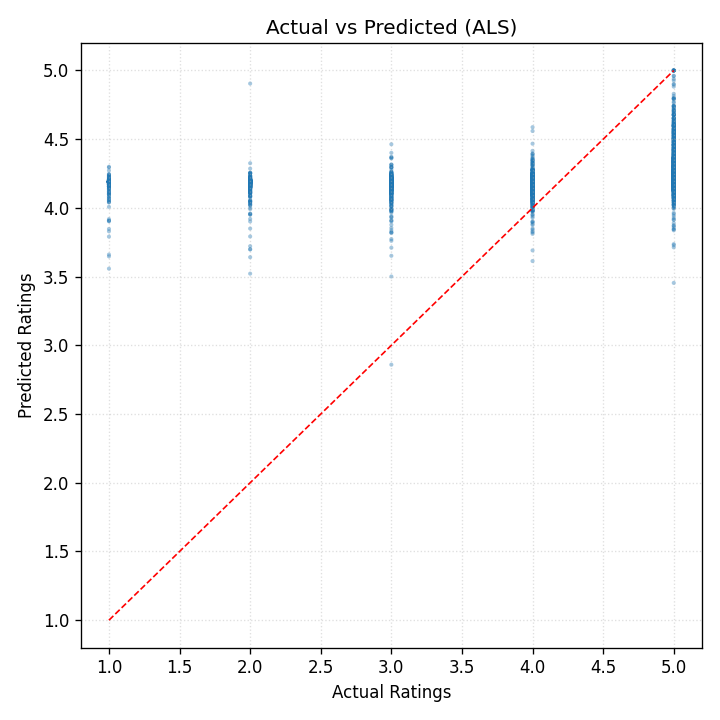

# NumPy-Based Amazon Recommendation System

## 1\. Tổng quan dự án

Dự án này xây dựng một hệ thống gợi ý sản phẩm (Recommendation System) cho ngành hàng **Beauty Products** trên Amazon. Điểm đặc biệt của dự án là việc **implement toàn bộ quy trình chỉ sử dụng thư viện NumPy**.

Dự án không sử dụng Pandas hay các Framework Deep Learning, nhằm mục tiêu tối ưu hóa khả năng tư duy đại số tuyến tính, kỹ thuật vectorization và xử lý ma trận thưa (Sparse Matrix) để giải quyết bài toán gợi ý sản phẩm thực tế.

## 2\. Mục lục

1.  [Tổng quan dự án](#1-tổng-quan-dự-án)
2.  [Mục lục](#2-mục-lục)
3.  [Giới thiệu](#3-giới-thiệu)
4.  [Dataset](#4-dataset)
5.  [Method (Quy trình & Thuật toán)](#5-method-quy-trình--thuật-toán)
6.  [Installation & Setup](#6-installation--setup)
7.  [Usage](#7-usage)
8.  [Results](#8-results)
9.  [Project Structure](#9-project-structure)
10. [Challenges & Solutions](#10-challenges--solutions)
11. [Future Improvements](#11-future-improvements)

## 3\. Giới thiệu

### 3.1. Mô tả bài toán

Trong thương mại điện tử, người dùng thường bị choáng ngợp bởi số lượng sản phẩm khổng lồ. Bài toán đặt ra là: *"Làm thế nào để dự đoán mức độ yêu thích (Rating) của một người dùng cụ thể đối với một sản phẩm mà họ chưa từng tương tác?"*.
Dự án này giải quyết vấn đề trên bằng cách xây dựng mô hình **Collaborative Filtering (Lọc cộng tác)** dựa trên lịch sử đánh giá của người dùng.

### 3.2. Động lực & Ứng dụng

  * **Thực tế:** Hệ thống gợi ý giúp tăng doanh thu cho Amazon bằng cách cá nhân hóa trải nghiệm mua sắm (Cross-selling/Up-selling).
  * **Học thuật:** Đây là cơ hội tuyệt vời để thực hành xử lý dữ liệu lớn và tính toán ma trận hiệu năng cao (High-performance matrix computation) mà không phụ thuộc vào các thư viện có sẵn như Pandas hay Scikit-surprise.

### 3.3. Mục tiêu cụ thể

  * Xây dựng pipeline xử lý dữ liệu thô (CSV) và chuyển đổi sang dạng ma trận User-Item bằng `numpy.genfromtxt` và Fancy Indexing.
  * Cài đặt thuật toán đo độ tương đồng (Cosine Similarity) bằng các phép toán đại số tuyến tính thuần túy.
  * Dự đoán Rating và đưa ra danh sách Top-K sản phẩm gợi ý cho người dùng.
  * Trực quan hóa phân phối Rating và độ thưa của dữ liệu bằng Matplotlib/Seaborn.

## 4\. Dataset

### 4.1. Nguồn dữ liệu

  * **Dataset Name:** Amazon Product Data - Beauty Category.
  * **Nguồn:** Amazon Reviews Data (được cung cấp trong phạm vi bài tập Homework 2).

### 4.2. Mô tả đặc trưng

Dữ liệu bao gồm các thông tin tương tác giữa người dùng và sản phẩm:

  * **User ID:** Mã định danh duy nhất của khách hàng (Dạng chuỗi ký tự - String).
  * **Product ID (ASIN):** Mã định danh duy nhất của sản phẩm (Dạng chuỗi ký tự - String).
  * **Rating:** Điểm đánh giá của khách hàng (Thang điểm 1.0 - 5.0).
  * **Timestamp:** Thời gian thực hiện đánh giá (Unix Timestamp).

### 4.3. Đặc điểm dữ liệu

  * **Sparsity (Độ thưa):** Ma trận tương tác rất thưa (Sparse), vì một người dùng chỉ đánh giá một phần rất nhỏ trong tổng số hàng triệu sản phẩm. Đây là thách thức chính khi lưu trữ và tính toán bằng NumPy array thông thường.
  * **Format:** Dữ liệu đầu vào là file CSV/JSON, yêu cầu kỹ thuật tiền xử lý để chuyển đổi (Encoding) từ chuỗi (ID) sang chỉ số (Index) số học để tính toán.

## 5. Method (Quy trình & Thuật toán)

### 5.1. Tiền xử lý dữ liệu
- Nạp dữ liệu thô từ `../data/raw/ratings_Beauty.csv` bằng `numpy.genfromtxt(..., skip_header=1)`; tách cột `user_id`, `product_id (ASIN)`, `rating`.
- Khảo sát ngưỡng lọc mức độ hoạt động của user: thử các ngưỡng `[5, 10, 15, 20, 25, 30, 50]`, trực quan hóa trade-off giữa `Density (%)`, số `Users` còn lại và số `Ratings` còn lại. Chọn ngưỡng tối ưu `15` (cân bằng giữa tăng mật độ và giữ dữ liệu).
- Lọc lại dữ liệu chỉ giữ user có ≥ 15 ratings; mã hóa ID sang chỉ số liên tục với `np.unique(..., return_inverse=True)` để thu được `user_indices`, `product_indices`, `final_ratings` và bảng tra cứu `unique_users_final`, `unique_products_final`.
- Tính kích thước ma trận cuối: `n_users`, `n_items`, cùng mật độ (`density`) sau lọc; trong lần chạy minh họa, mật độ tăng lên khoảng `~0.0488%` (từ ~0.0074%).
- Lưu 5 tệp vào `../data/processed/` để dùng cho bước mô hình: `user_indices.npy`, `product_indices.npy`, `ratings.npy` (tương ứng `final_ratings`), `user_ids_map.npy`, `product_ids_map.npy`.
- Notebook `03_modelling.ipynb` đọc các tệp này và thực hiện chia `train/test` 80/20 (seed 42) trước khi huấn luyện các mô hình.

### 5.2. Baseline: User-based Collaborative Filtering (UCF)
- Tính ma trận tương đồng user-user bằng Cosine Similarity.
- Dự đoán dựa trên trung bình có trọng số của top-k neighbors đã đánh giá item.
- Lý do chọn user-based thay vì item-based: số lượng item rất lớn → ma trận tương đồng item–item dễ vượt RAM; UCF thực dụng hơn làm baseline.

Implement bằng NumPy:
- Tạo `UI` (Users × Items) từ tập train, các ô chưa có đánh giá là 0.
- Cosine similarity thuần NumPy: `Sim = (UI @ UI.T) / (||UI_u|| · ||UI_v||)` với `norms = np.linalg.norm(UI, axis=1)` và `np.outer(norms, norms)`; đặt đường chéo bằng 0 bằng `np.fill_diagonal`.
- Dự đoán toàn phần: `Pred = (Sim @ UI) / (|Sim| @ Mask)` với `Mask = (UI>0).astype(float)` để chỉ cộng các ô đã có rating.
- Dự đoán theo cặp (không tạo full matrix): lấy cột item từ `UI`, lọc các "raters" bằng mask, dùng `np.argpartition` để chọn top-k theo từng cặp, rồi tính trung bình có trọng số bằng `np.einsum('kn,kn->n', topk_sims, topk_rates)`; nếu không có hàng xóm hợp lệ thì rơi về trung bình cột.

### 5.3. Matrix Factorization (MF)
a) MF-SGD: học `P` (Users × K), `Q` (Items × K) kèm bias toàn cục `μ`, `b_u`, `b_i`; cập nhật bằng gradient vector hóa; dự đoán được clip về [1,5].

Implement bằng NumPy (MF-SGD – vector hóa):
- Khởi tạo `P, Q ~ N(0, 0.01)`; `b_u, b_i = 0`; `μ = mean(ratings)`.
- Không lặp từng quan sát; thay vào đó gom gradient theo user/item:
  - Dự đoán batch: `pred = μ + b_u[u] + b_i[i] + einsum('nf,nf->n', P[u], Q[i])`.
  - Sai số: `err = r - pred`.
  - Gom gradient bias: `np.add.at(bu_grad, u, err)`, `np.add.at(bi_grad, i, err)`.
  - Gom gradient cho `P, Q`: `np.add.at(P_grad, u, err[:,None]*Q[i])`, `np.add.at(Q_grad, i, err[:,None]*P[u])`.
  - Regularization theo số lần xuất hiện: `counts_u = np.bincount(u, minlength=n_users)`, `counts_i = np.bincount(i, minlength=n_items)`; cập nhật `P, Q, b_u, b_i` bằng bước học `lr` và `reg` theo counts.
- Dự đoán theo cặp: dùng `np.einsum('nf,nf->n', P[u], Q[i]) + μ + b_u[u] + b_i[i]` và `np.clip` về [1,5] nếu cần.

b) ALS (VectorizedALS): cập nhật toàn cục bằng công thức đóng:
  - `P ← R Q (Qᵀ Q + λ I)⁻¹`
  - `Q ← Rᵀ P (Pᵀ P + λ I)⁻¹`
  - Dự đoán: `⟨P_u, Q_i⟩ + μ`, có thể clip về [1,5].
- Định hướng: ưu tiên latent-feature learning thay vì feature engineering thủ công; mở rộng hybrid khi có metadata.

Implement bằng NumPy (ALS – vector hóa toàn cục):
- Tạo ma trận dense `R` (Users × Items), trừ `μ` trên các ô có rating (`mask = (R!=0); R[mask] -= μ`).
- Vòng lặp:
  - Tính `QtQ = Q.T @ Q`; nghịch đảo có điều chuẩn: `inv_Q = inv(QtQ + λI)`.
  - Cập nhật toàn cục: `P = R @ Q @ inv_Q`.
  - Tính `PtP = P.T @ P`; `inv_P = inv(PtP + λI)`.
  - Cập nhật toàn cục: `Q = R.T @ P @ inv_P`.
- Dự đoán theo cặp: `einsum('ij,ij->i', P[users], Q[items]) + μ`; có thể `np.clip`.

Ghi chú hiệu năng/bộ nhớ:
- UCF và MF-SGD hoạt động tốt trên dữ liệu thưa vì tránh tạo ma trận item–item lớn hoặc lặp từng phần tử chậm.
- Phiên bản ALS này dùng `R` dense để tối đa vector hóa; trên ma trận rất lớn cần cân nhắc dạng sparse hoặc giảm `K`/`n_iters`.

### 5.4. Đánh giá
- Chỉ số lỗi: MAE, MSE, RMSE.
- Cross Validation: 5-Fold trên toàn bộ (u, i, r) để đo khả năng tổng quát hóa.

## 6. Installation & Setup

### 6.1. Yêu cầu môi trường
- Python 3.10+
- NumPy (và tùy chọn: Matplotlib/Seaborn cho trực quan)

### 6.2. Cài đặt môi trường (khuyến nghị venv)

```bash
# Tạo và kích hoạt môi trường ảo (Windows)
python -m venv .venv
.venv\Scripts\activate

# Cài đặt dependencies
pip install -r requirements.txt
```

## 7. Usage

### 7.1. Chạy các notebook
- Phân tích khám phá dữ liệu: mở và chạy `notebooks/01_data_exploration.ipynb`.
- Tiền xử lý: mở và chạy `notebooks/02_preprocessing.ipynb`.
- Mô hình & đánh giá: mở và chạy `notebooks/03_modelling.ipynb`.

### 7.2. Cấu hình nhanh trong notebook 03
- Điều chỉnh các tham số:
  - UCF: `k` (số hàng xóm).
  - MF-SGD: `n_factors`, `lr`, `reg`, `n_epochs`, `clip`.
  - VectorizedALS: `n_factors`, `reg`, `n_iters`.
- Bật 5-Fold CV để so sánh ba mô hình.

## 8. Results

### 8.1. Kết quả minh họa (5-Fold CV)
- User-CF  → MAE ≈ 5.71 | MSE ≈ 375.92 | RMSE ≈ 19.38
- MF-SGD   → MAE ≈ 1.09 | MSE ≈ 2.39   | RMSE ≈ 1.54
- ALS      → MAE ≈ 0.93 | MSE ≈ 1.37   | RMSE ≈ 1.17

#### Insights
- Hiệu năng theo thang điểm 1–5: RMSE ≈ 1.17 (ALS) cho thấy sai số trung bình khoảng ~1.17 điểm — đủ tốt cho nhiều tác vụ xếp hạng/ưu tiên sản phẩm, nhưng vẫn có khoảng nâng cấp bằng tinh chỉnh tham số hoặc cải thiện dữ liệu.
- UCF trên dữ liệu thưa: Ma trận tương tác quá thưa khiến rất nhiều cặp (u,i) thiếu hàng xóm phù hợp; dự đoán trở nên lệch và phân tán, dẫn đến RMSE rất cao. Với bài toán quy mô lớn, UCF nên dùng như baseline tham chiếu, không phải phương pháp chính.
- MF-SGD vs ALS: Cả hai đều tận dụng latent factors để khái quát hóa. ALS hội tụ nhanh, ổn định khi dùng cập nhật toàn cục; MF-SGD linh hoạt, dễ mở rộng thêm bias/regularization theo user/item.
- Ảnh hưởng của tiền xử lý: Việc lọc user theo ngưỡng hoạt động (≥15 ratings) tăng mật độ giúp cả MF và ALS học tốt hơn. Chọn ngưỡng quá thấp làm tăng nhiễu; quá cao làm mất dữ liệu — cân bằng là quan trọng.
- Thực dụng cho vận hành: Nếu cần tốc độ thử nghiệm, giảm `n_factors` hoặc `n_iters` (ALS) vẫn cho kết quả hợp lý; khi đánh giá cuối, tăng dần để đạt sai số thấp nhất.

### 8.2. Trực quan hóa

Biểu đồ được sinh tự động từ notebook `notebooks/03_modelling.ipynb` và lưu tại thư mục `figures/`:




Mẹo tái tạo nhanh:

- Chạy các cell đánh giá mô hình ở phần 6 để có `predictions_*` và các chỉ số.
- Chạy cell "Trực quan hoá kết quả (Visualization)" ở cuối notebook để sinh ảnh.

## 9. Project Structure

```
hcmus-programmingds--lab02/
  data/
    raw/                      # Dữ liệu thô (CSV)
    processed/                # Numpy arrays (npy) đã xử lý
  notebooks/
    01_data_exploration.ipynb # Phân tích khám phá dữ liệu
    02_preprocessing.ipynb    # Tiền xử lý dữ liệu
    03_modelling.ipynb        # UCF, MF-SGD, VectorizedALS, CV & so sánh
  requirements.txt            # Phụ thuộc Python
  README.md                   # Tài liệu dự án
```

## 10. Challenges & Solutions
- Độ thưa cao: dùng latent-feature learning (MF) để khái quát hóa; hạn chế phụ thuộc vào hàng xóm trực tiếp.
- Bộ nhớ: tránh ma trận tương đồng item–item; dùng VectorizedALS và tham số vừa phải (`n_factors`, `n_iters`).
- Tối ưu tốc độ: vector hóa NumPy; giảm số vòng lặp cho thử nghiệm; có thể dùng Cholesky/giải pháp đóng.
- Đánh giá đáng tin cậy: 5-Fold CV để giảm lệch chia tập.

## 11. Future Improvements
- Thêm ranking metrics: Precision@K, Recall@K, NDCG@K cho gợi ý top-N.
- Hybrid models: kết hợp metadata item/user (nếu có) với MF (Factorization Machines/SVD++).
- Early stopping & validation: chọn siêu tham số bằng tập validation riêng.
- Sparse optimizations: chuyển sang dạng thưa cho R khi kích thước cực lớn; cân nhắc thư viện tối ưu hóa.

